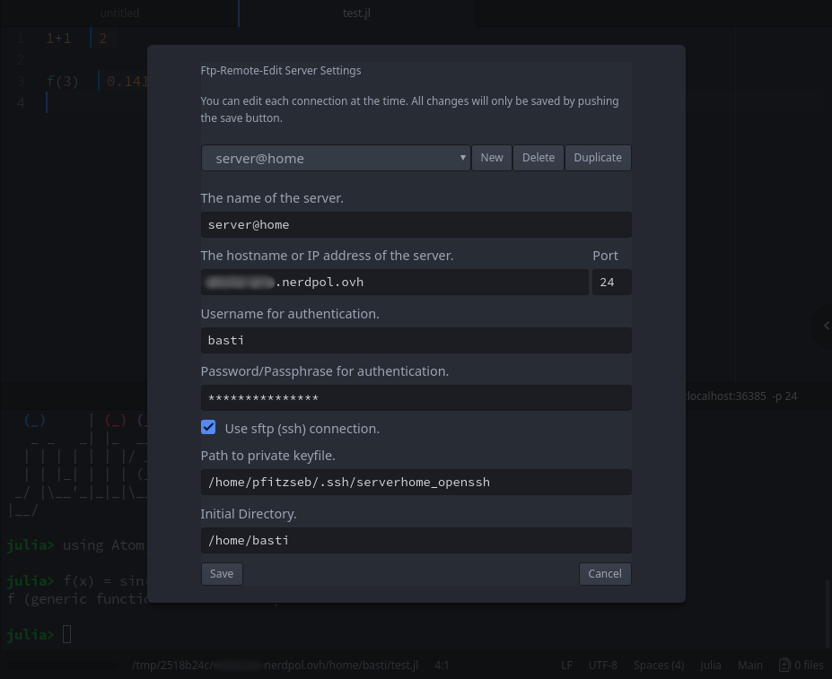

# FAQ

### I am having issues, where do I leave a bug report?

Please leave bug reports either [at the discussion board](https://discourse.julialang.org)
or [at the Juno.jl Github repository](https://github.com/JunoLab/Juno.jl/issues).

### Juno doesn't work properly after an update. What do I do?
Check whether you have a little red bug symbol in the status bar (lower right):


If so, click on it and then click on "Rebuild Packages":


Restart Atom and you should be good to go!

---

There's a chance the update of `julia-client` failed. To get a clean re-install
while preserving any setting you might have changed, try the following steps:

1. Close all Atom instances.
2. Start a terminal (e.g. `cmd` on Windows or the Terminal App on MacOS)
3. Execute `apm uninstall julia-client`.
4. Execute `apm install julia-client`.
5. Start Juno. Evertyhing should work again.

### Some Juno package is using the wrong precompile cache, what do I do?

This problem manifests itself in errors like:

```julia
WARNING: Method definition
WARNING: Module Juno with uuid 738353145462472 is missing from the cache.
ERROR: LoadError: Declaring precompile(false) is not allowed in files that are being precompiled.
ERROR: LoadError: Failed to precompile Atom to C:\Users...
```

One way this can occur is from updating Julia versions. However, this has a very
easy fix. Go into the Julia REPL (not the Juno console in Atom, but the actual
Julia terminal window) and type in the command:

```julia
using Atom
```

That will force Julia to re-compile all of the cache files and should fix the problem.

### I am having a problem running Juno with an older version of Julia, why?

Juno is under rapid development, so it's expected that previous versions may not
be compatible with the Atom packages overtime. Julia will automatically use older
versions on the Julia-side packages, but Atom will always give you the most up-to-date
packages it knows about, which causes this issue. The easy way to solve this is
to always use the current Julia release. Otherwise, resort to the [Developer Installation Instructions](@ref)
for the Atom packages and use git to checkout an older version. This requires some
git know-how, so it's only recommended if the older version of Julia is truly necessary.

### How do I use Juno with the Julia Nightly version?

If you want to use Juno with the nightly version use caution: this package is under
rapid development so do so at your own risk. That being said, the Julia nightly
should work using the [Developer Installation Instructions](@ref). Note that this will require you to
be on master for the Julia and Atom packages, so things will be changing likely
before documentation changes.

### How do I execute code on Juno startup?

Much like Julia has its `~/.julia/config/startup.jl` file for executing code on startup, Juno will execute code contained in `~/.julia/config/juno_startup.jl` after Julia has been booted and a connection with the editor is established. This allows running code on startup that queries the frontend, e.g. [`Juno.syntaxcolors`](@ref).

## Advanced topics

### Connecting to a Julia session in a (local) Docker container

Use case: local installation of Juno with a local Docker container

1. Launch Atom/Juno on your local machine
2. Spin up your docker container with network_mode:host, ie.

```bash
docker run -it --network=host [container_name] julia
```

3. In Atom/Juno, bring up [The Command Palette](@ref) and search for `Julia Client: Connect External Process`
4. Juno will respond with a Julia command, e.g. `using Juno; Juno.connect([Atom port])`, where **[Atom port]** is the port Atom is listening on for the Julia session to connect.
5. In the Julia session, replace **[Atom port]** in the following command with the port specified by Atom & enter the following command to connect your Julia session to Atom

For Mac:
```julia
using Juno; Juno.connect("docker.for.mac.host.internal", [Atom port])
```

For Linux (untested):
```julia
using Juno; Juno.connect("docker0", [Atom port])
```

### Connecting to a Julia session on a remote machine

Juno can be used for editing and executing code on a remote machine (which might be very useful for computationally expensive tasks or when you want to use hardware not available locally, e.g. GPUs).

#### Prerequisites

The remote machine must have Julia installed and you need to be able to open a ssh connection to it. On your local machine you need a working Juno installation as well as a remote code editing package, for example [`ftp-remote-edit`](https://github.com/h3imdall/ftp-remote-edit) (or [`remote-edit-ni`](https://github.com/newinnovations/remote-edit-ni)).

#### Setting up Julia

Open a new terminal in Juno with `Julia Client: New Terminal` and execute the `Julia Client: Connect External Process` command in Juno:


In the terminal you'll need to `ssh` into the remote machine with port forwarding. This can be done with the
following command
```
ssh -R <RemotePort>:localhost:<JunoPort> you@yourserver
```
where `<RemotePort>` is a port you can choose freely and `<JunoPort>` is the port given by the `Connect External Process` command.

For servers that listen on a non-standard `ssh` port you'll also need to add the correct `-p` flag; I'd also recommend using an identity file with the `-i` option.


After you're succesfully logged into the server you need to start Julia, potentially `pkg> add Atom Juno`, and execute
```
using Atom; using Juno; Juno.conect(<RemotePort>)
```
You should get a message telling you that Juno succesfully connect to an external process; after that basically all of Juno's features should work fine:


#### Setting up remote file editing

Add a new server in `ftp-remote-edit`'s server browser:



and you can start editing files!


