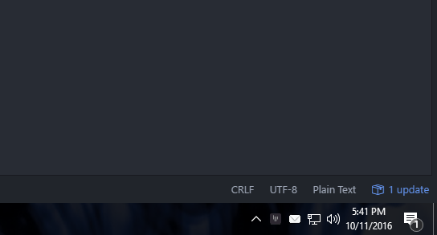

# FAQ

### I am having issues, where do I leave a bug report?

Please leave bug reports either [at the discussion board](http://discuss.junolab.org/)
or [at the Juno.jl Github repository](https://github.com/JunoLab/Juno.jl/issues).

### Some Juno package is using the wrong precompile cache, what do I do?

This problem manifests itself in errors like:

```julia
WARNING: Method definition
WARNING: Module Juno with uuid 738353145462472 is missing from the cache.
ERROR: LoadError: Declaring precompile(false) is not allowed in files that are being precompiled.
ERROR: LoadError: Failed to precompile Atom to C:\Users...
```

One way this can occur is from updating Julia versions. However, this has a very
easy fix. Go into the Julia REPL (not the Juno console in Atom, but the actual
Julia terminal window) and type in the command:

```julia
using Atom
```

That will force Julia to re-compile all of the cache files and should fix the problem.

### What are these warnings in the console?

If you are experiencing warnings like:

```julia
WARNING: julia-client: can't render lazy
```

or

```julia
WARNING: Atom.jl: unrecognised message clearLazy.
```

there's no reason to be alarmed: these warnings are harmless. They mostly occur
because Juno is developing very fast, and so the package versions you have may
be "out of sync". The most common fix is to `Pkg.update()` and to make sure your
your Atom packages are up to date (a blue box shows up in the in the bottom right corner
when an update is available).



If none of these work, again there's no need to worry since these warnings are not
breaking. Note that if you are on the Julia nightly version, you should expect that these
warnings may occur, it's just part of being on the bleeding edge.

### I am having a problem running Juno with an older version of Julia, why?

Juno is under rapid development, so it's expected that previous versions may not
be compatible with the Atom packages overtime. Julia will automatically use older
versions on the Julia-side packages, but Atom will always give you the most up-to-date
packages it knows about, which causes this issue. The easy way to solve this is
to always use the current Julia release. Otherwise, resort to the [Developer Install]()
for the Atom packages and use git to checkout an older version. This requires some
git know-how, so it's only recommended if the older version of Julia is truly necessary.

### How do I use Juno with the Julia Nightly version?

If you want to use Juno with the nightly version use caution: this package is under
rapid development so do so at your own risk. That being said, the Julia nightly
should work using the [Developer Install](). Note that this will require you to
be on master for the Julia and Atom packages, so things will be changing likely
before documentation changes.

## Advanced topics

### Connecting to an external julia session on a remote machine

Use case: local installation of Juno with a remote julia session

1. Launch Atom/Juno on your local machine
2. In Atom/Juno: `Julia Client: Connect External Process` (Juno will then tell you which port to use locally --> we'll call it `Port#2`)
3. Port forwarding

  *Linux/Unix*: Open a local terminal and connect to your remote server : `ssh -R PORT#1:localhost:PORT#2 your.server.com`
  
  *Windows*: Port forwarding via `netsh` should work. See [here](http://stackoverflow.com/questions/11525703/port-forwarding-in-windows) for an example.
  
4. Launch julia in the terminal on the remote machine
5. Type in julia session: `using Juno; Juno.connect(PORT#1)`

