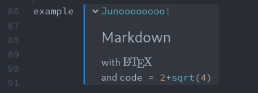
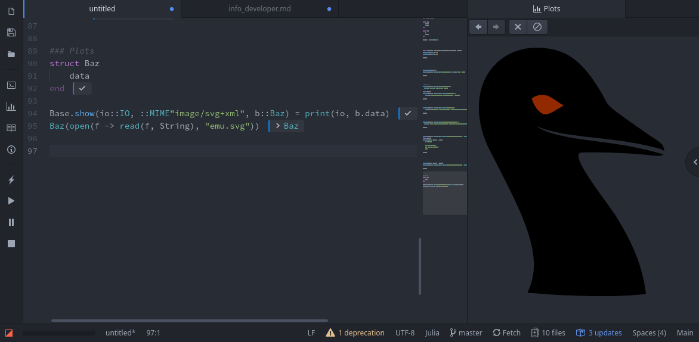

# Information for Package Developers

## Custom Inline Display
Juno's inline display system operates on three distinct levels:

1. If you create a new type and don't define a `show` method for it, Juno will use a fallback that lazily shows all fields.
2. If you've defined a `show` method for the `text/plain` MIME type Juno will use that to create a simple Tree View.
3. [TreeViews.jl](https://github.com/pfitzseb/TreeViews.jl) allows customizing *everything* about how your type is displayed.

The following will show how to use the TreeViews.jl API for pretty-printing in a few simple cases.

First, let's define some custom types we want to display:
```julia
struct Foo
    field1
    field2
end

struct Bar
    a
    field1
end
```

By default, Juno displays those like this:


To switch to a TreeViews.jl display we can simply overload the following methods for out types:
```julia
import TreeViews: hastreeview, numberofnodes, treelabel, treenode
hastreeview(::Foo) = true
hastreeview(::Bar) = true
```
Since TreeViews.jl implements sensible defaults for custom types, this gives us


It is of course possible to customize this to your heart's content. For example, we might
only want to display `Foo`s first field with
```julia
numberofnodes(::Foo) = 1
```
or change the `Foo` in the first line to something else:
```julia
treelabel(io::IO, x::Foo, ::MIME"text/plain") = print(io, "I'm a Foo.")
```


Juno accepts a few different MIME types:
  - `text/plain`: Probably best compatibility.
  - `text/html`: Allows much richer display options (e.g. LaTeX).
  - `application/juno+inline`: Same as `text/html`, but specific to Juno.

Even `text/plain` allows for some (limited) control over styling (colors, decorations).
In general, you can print the correct [SGR codes](https://en.wikipedia.org/wiki/ANSI_escape_code#SGR) and
everything will work, but I'd recommend using [Crayons.jl](https://github.com/KristofferC/Crayons.jl) or a
similar library instead:
```julia
# plain SGR
treelabel(io::IO, x::Foo, ::MIME"text/plain") =
  print(io, "\x1b[32mHello\x1b[0m there")

using Crayons
treelabel(io::IO, x::Foo, i::Int, ::MIME"text/plain") =
  print(io, crayon"(250,20,105) bold"("General"), " Kenobi")
```


!!! note

    Those styles also apply to display in the REPL, provided for example by the as-of-yet
    unregistered [REPLTreeViews.jl](https://github.com/pfitzseb/REPLTreeViews.jl) package:

    


Using `text/html` allows for greater customization by using inline CSS
```julia
treelabel(io::IO, x::Foo, i::Int, ::MIME"text/html") =
  print(io, "<span><span style=\"color:aqua; font-size:0.7em\">General</span> Kenobi</span>")
```


The `application/juno+inline` MIME type allows you to make use of the styling Atom uses:
```julia
treelabel(io::IO, x::Foo, ::MIME"application/juno+inline") =
  print(io, "<span class=\"syntax--support syntax--type syntax--julia\">Junoooooooo!</span>")
```


It's also possible to e.g. print no label for `Foo`s first field and handle everything in with `treenode`:
```julia
treelabel(io::IO, x::Foo, i::Int, ::MIME"application/juno+inline") = print(io, "")
using Markdown
treenode(x::Foo, i::Int) = MD("""
    ## Markdown

    with ``\\LaTeX``\n
    and `code = 2+sqrt(4)`
    """)
```


To hide the `treenode` display, simply return `missing`:
```julia
treenode(x::Foo, i::Int) = missing
treelabel(io::IO, x::Foo, i::Int, ::MIME"application/juno+inline") = print(io, "...")
```


Nothing at all will be shown if `treelabel` doesn't print anything *and* `treenode` returns
`missing`.


## Displaying Plots and Graphics
Plots can be displayed by providing a `show` method for one of the following MIME types (ordered
by priority):
  1. `application/juno+plotpane` - rendered in a [`webview`](https://electronjs.org/docs/api/webview-tag)
  2. `image/svg+xml` - rendered in a [`webview`](https://electronjs.org/docs/api/webview-tag)
  3. `image/png`
  4. `image/jpeg`
  5. `image/tiff`
  6. `image/bmp`
  7. `image/gif`

The first two of those MIME types are rendered in a `webview` to a) prevent XSS and b) make sure not to crash
Atom for big or complex graphics. For the others we provide some basic pan and zoom utilities.


So if you want to e.g. display an `svg` you can do the following:
```julia
struct Baz
    data
end

Base.show(io::IO, ::MIME"image/svg+xml", b::Baz) = print(io, b.data)
Baz(open(f -> read(f, String), "emu.svg"))
```


`application/juno+plotpane` is HTML, but also indicates that you want your type to be displayed in Juno's Plot
Pane.
```julia
struct Blah
    data
end

function Base.show(io::IO, ::MIME"application/juno+plotpane", b::Blah)
    colors = get(io, :juno_colors, nothing)
    size = get(io, :juno_plotsize, [100, 100])

    html = """
    <div style="
        background-color: #eee;
        color: #222;
        width: $(size[1]-40)px;
        height: $(size[2]-40)px;
        position: absolute;
        top: 0;
        left: 0;
        padding: 20px;
        margin: 0;
        ">
        <span>$(b.data)</span>
        <br/>
        <input/>
    </div>
    """    

    print(io, html)
end

Blah("Input stuff here:")
```

