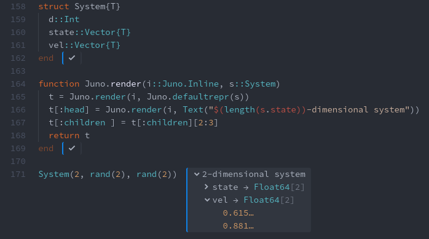

# Information for Package Developers
In this page we giving some information that can help Package developers interact smoothly with Juno, and use it to their advantage for e.g. displaying Types, graphics etc.

## Custom Type Printing
As was mentioned in the [Basic Usage](@ref) page, you can enhance the way user-defined types are printed in the Juno console (or similarly during inline evaluation). *Note*: The difference
between printing in Juno and in the REPL is discussed in the follow-up section.

This enhancing is done by extending the `Juno.render(::MyType)` function to match your type.

```@docs
Juno.render
Juno.@render
```

As an example, we will use the type
```julia
struct System{T}
  d::Int
  state::Vector{T}
  vel::Vector{T}
end

s = System(2, rand(2), rand(2))
```
which, by default is displayed in Juno using a `Juno.Tree` structure, with the "head" displaying the Type information, and expandable arrows for all the fields that are expandable, meaning, the head itself, as well as the 2nd and 3rd fields, which are vectors.

The most basic way to change this, is to simply add some custom strings to `Juno.render` like:
```julia
import Juno.render
function Juno.render(i::Juno.Inline, s::System)
  str = "$(s.d)-dimensional system"
  Juno.render(i, Text(str))
end
```
and then, this will change the way Juno displays the system to simply: "2-dimensional system". It is important to have the first argument `i::Juno.Inline` in your definition, instead of some `println()` function call, because this ensures that the information is shown correctly either at the console or on inline evaluation (with e.g. Shift+Enter at the editor).

`Juno.Inline` is one of the predefined rendering contexts defined in Juno:
```@docs
Juno.Inline
Juno.Clipboard
Juno.PlotPane
```

However, with this approach you lose the cool interactivity of Juno allowing you to expand fields as you like. Let's say that you would like to keep the Juno display format, but simply change the message displayed on the "head", because for example you might not want the type information to be displayed. This is done by changing the "head" of the `Juno.Tree` that is created by default:
```julia
function Juno.render(i::Juno.Inline, s::System)
  t = Juno.render(i, Juno.defaultrepr(s))
  t[:head] = Juno.render(i, Text("$(length(s.state))-dimensional system"))
  t
end
```
```@docs
Juno.defaultrepr
```

But now you notice that you display the dimension information both at the "head" of the tree, but also on one of the "children", since by default all fields of a Type are printed. Well, thankfully, it is really easy to remove a children from display:
```julia
function Juno.render(i::Juno.Inline, s::System)
  t = Juno.render(i, Juno.defaultrepr(s))
  t[:head] = Juno.render(i, Text("$(length(s.state))-dimensional system"))
  t[:children ] = t[:children][2:3]
  return t
end
```


Here, each entry in the vector `t[:children]` is one displayed entity of the `Juno.Tree`. By removing the first entry (which is the first field of our Type) we are now displaying only the fields `state` and `vel`. Of course, it goes without saying that you can completely change how the fields are displayed (e.g. change the `vel` display to `velocity`) by going deeper into `t[:children]`.

It's also possible to display arbitrary HTML in results: There are `render` methods for all the HTML primitives defined in [Hiccup.jl](https://github.com/JunoLab/Hiccup.jl) as well as for certain higher-level elements from Juno.jl or even Base
```@docs
Juno.Tree
Juno.LazyTree
Juno.SubTree
Juno.Link
Juno.Table
Juno.Row
Base.Text
```

Should you wish to render something in the `PlotPane`, you can get it's dimensions via
```@docs
Juno.plotsize
```

### Printing in REPL vs. Juno
If a method for `Base.show` is present, but *no* method exists for `Juno.render`, then Juno will fall back to `show`. If both exist however, you can get the awesome display capabilities of Juno, while still having custom support for your Types in the REPL. For example, by adding the function:
```julia
import Base.show
function Base.show(io::IO, s::System)
  println(io, "$(length(s.state))-dimensional system")
  println(io, "state: $(s.state)")
  println(io, "velocity $(s.vel)")
end
```
you can support custom printing at the REPL as well, without ruining the Juno printing.

### Conditionally defining Juno-specific render methods
It is possible to use [Requires.jl](https://github.com/MikeInnes/Requires.jl) to circumvent having a hard dependency on Juno.jl for rendering:
```julia
@require Juno begin
  using Juno
  function Juno.render(i::Juno.Inline, s::System)
    t = Juno.render(i, Juno.defaultrepr(s))
    t[:head] = Juno.render(i, Text("$(length(s.state))-dimensional system"))
    t[:children] = t[:children][2:3]
    return t
  end
end
```
