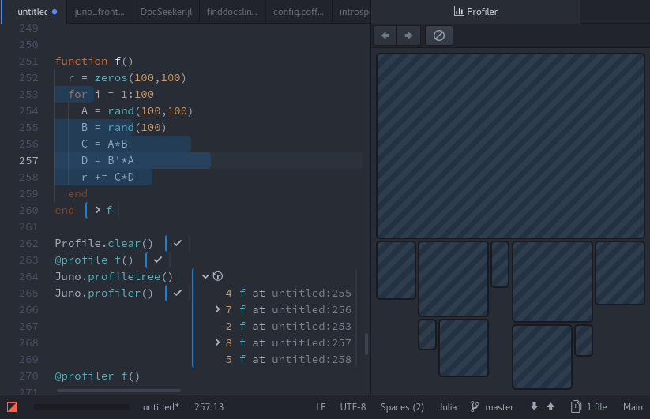

# The Juno.jl Front-End
Juno provides some functionality using Atom's UI, which will usually have a
fallback for use in other environments.

The `isactive()` function will provide an interface for figuring out whether the
current session is running within Juno:

```@docs
Juno.isactive
```

## Enhanced Display

Juno.jl includes features which allow package developers to created enhanced displays
in Juno.

For example, we can print provide structured display for arbitrary objects (similar to `Base.dump`)


```@docs
Juno.structure
```

## Profiler
Profiles collected by `@profile` can be displayed as a flame chart (similar to `ProfileView.jl`)
inside of Juno by calling `Juno.profiler()`. `Juno.profiletree()` will display the stack
trace similar to the output of Base's `Profile.print()`. There's also a `@profiler` macro
which does the same as `@profile` but also displays the collected information as a flame chart
and clears all collected backtraces beforehand.

```@docs
Juno.profiler
Juno.profiletree
Juno.@profiler
```


Clicking on one of the boxes in the profile view will take you to the corresponding file/line.
The length of the lines in the editor correspond to the percentage of calls made in that line;
to clear the profile view and the in-editor display, click the `Forget Plot` button in the
profile view toolbar.

## Progress Meters

Juno.jl allows package developers to use the progress bar which is provided in the
Atom window. For example, you can easily show a progress meter for a `for loop`
via the command:

```julia
@progress for ...
```


The following functions provide this interface:

```@docs
Juno.@progress
Juno.progress
```

It is recommended to either use the `@progress` macro or the
```julia
progress(name = "Foo") do p

end
```
notation to ensure that the progress bars are properly unregistered in the
frontend.

## Interaction

Juno.jl lets package developers interact with users via the Atom frontend. For example,
you can allow the user to select from a list of options:

```@docs
Juno.selector
```


or send an OS-level notification:

```@docs
Juno.notify
```

You can also use

```@docs
Juno.syntaxcolors
```

for querying the currently used syntax colors in Atom (and generate a plot theme or an OhMyREPL syntax theme from that).

The console can be cleared with
```@docs
Juno.clearconsole
```
or `Ctrl-J Ctrl-C`.
