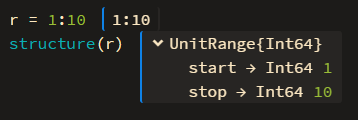
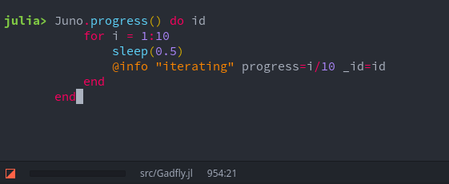
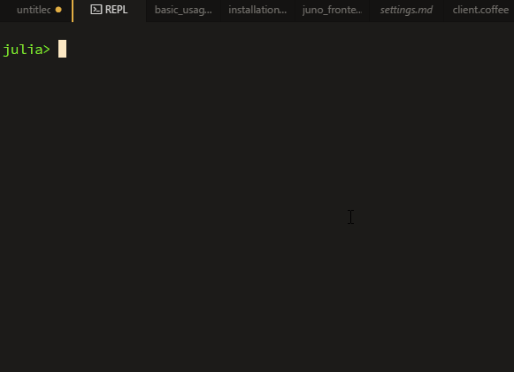

# The Juno.jl Front-End
Juno provides some functionality using Atom's UI, which will usually have a
fallback for use in other environments.

The `isactive()` function will provide an interface for figuring out whether the
current session is running within Juno:

```@docs
Juno.isactive
```

## Enhanced Display

Juno.jl includes features which allow package developers to created enhanced displays
in Juno.

For example, we can print `info` to the console in a nicer way:

```julia
info("foo")
```


```@docs
Juno.info
```

or provide structured display for arbitrary objects (similar to `Base.dump`)



```@docs
Juno.structure
```

### Display system

For a types that have no custom rendering defined (see below), Juno's display system will fall back to
- `show`, if there's a `show` method more specific than the catch-all fallback method `show(io, ::Any)` or
- lazy structured display similar to `Juno.structure` otherwise.

To change how Juno displays a type
```julia
type CustomType
  field_a
  field_b
end
```
it's necessary to add a new `Juno.render` method for that type:
```julia
function Juno.render(i::Juno.Inline, x::CustomType)
  Juno.render(i, Juno.Tree(Text(x.field_a), [Text(field_b)]))
end
```
or, using the more convenient `Juno.@render` macro, which calls `Juno.render` on it's first argument (`Juno.Inline` in this case) and whatever it's body evaluates into:
```julia
Juno.@render Juno.Inline x::CustomType begin
  Juno.Tree(Text(x.field_a), [Text(x.field_b)])
end
```
```@docs
Juno.render
Juno.@render
```


`Juno.Inline` is one of the predefined rendering contexts defined in Juno:
```@docs
Juno.Inline
Juno.Clipboard
Juno.PlotPane
```

There are `render` methods for all the HTML primitives defined in [Hiccup.jl](https://github.com/JunoLab/Hiccup.jl) as well as for certain higher-level elements from Juno.jl or even Base
```@docs
Juno.Tree
Juno.LazyTree
Juno.SubTree
Juno.Link
Juno.Table
Juno.Row
Base.Text
```


Should you wish to render something in the `PlotPane`, you can get it's dimensions via
```@docs
Juno.plotsize
```

## Progress Meters

Juno.jl allows package developers to use the progressbar which is provided in the
Atom window. For example, you can easily show a progress meter for a `for loop`
via the command:

```julia
@progress for ...
```



The following functions provide this interface:

```@docs
Juno.@progress
Juno.progress
Juno.ProgressBar
Juno.name
Juno.msg
Juno.right_text
Juno.done
```

It is recommended to either use the `@progress` macro or the
```julia
progress(name = "Foo") do p

end
```
notation to ensure that the progress bars are properly unregistered in the
frontend.

## Interaction

Juno.jl lets package developers interact with users via the Atom frontend. For example,
you can allow the user to select from a list of options:

```@docs
Juno.selector
```



or get input in the console:

```@docs
Juno.input
```


```@docs
Juno.notify
```

As of version 0.5.11 of Atom.jl, `Base.readline()` will also correctly request user input from the console instead of stalling indefinitely.
